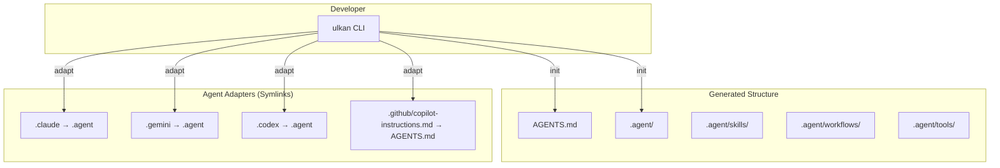

# System Architecture

## Overview
Ulkan is a single-package Python CLI application that generates files and symlinks. It has no runtime dependencies beyond standard library for generated files, and uses Typer/Rich for the CLI experience.

## Component Diagram (C4 Context)



## Package Structure

```
src/ulkan/
├── main.py          # Entry point, exports Typer app
├── commands.py      # CLI commands: init, adapt
├── generator.py     # File/directory creation logic
├── templates.py     # All file templates as Python strings (~800 lines)
├── agents.py        # Symlink creation for agent adapters
└── styles.py        # Rich console theming
```

## Tech Stack
- **Language**: Python 3.12+
- **CLI Framework**: Typer (built on Click)
- **Output Styling**: Rich
- **Build System**: Hatchling (PEP 517)
- **Package Manager**: uv

## Key Design Patterns

### 1. Templates as Python Strings
All file templates are stored in `templates.py` as multiline strings. This:
- Keeps templates under version control
- Avoids file I/O for template loading
- Makes testing easier (just import and compare)

### 2. Single Source of Truth
`.agent/` and `AGENTS.md` are canonical. Agent-specific folders are symlinks:
```
.claude → .agent
.gemini → .agent
CLAUDE.md → AGENTS.md
```

### 3. Zero Runtime Dependencies
Generated files (sync scripts, lint scripts) use only Python stdlib to avoid forcing users to install dependencies.

## Data Flow

```
ulkan init:
  1. Create AGENTS.md from template
  2. Create .agent/ directory tree
  3. Write all skill SKILL.md files
  4. Write all workflow .md files
  5. Write maintenance scripts

ulkan adapt --all:
  1. Check .agent/ exists
  2. For each agent:
     - Remove existing folder/file
     - Create symlink to .agent or AGENTS.md
     - Add to .gitignore
```
