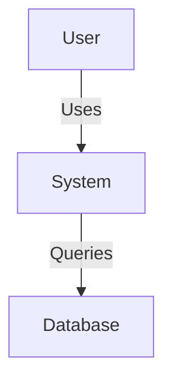

# System Architecture

## Overview
{High-level description of the system}

## Component Diagram (C4 Context)

## Tech Stack
- **Frontend**: {React, Vue, etc.}
- **Backend**: {Python, Node, etc.}
- **Database**: {Postgres, Mongo, etc.}
- **Infra**: {Docker, K8s, AWS}

## Key Patterns
- {Event Sourcing, CQRS, MVC, etc.}
